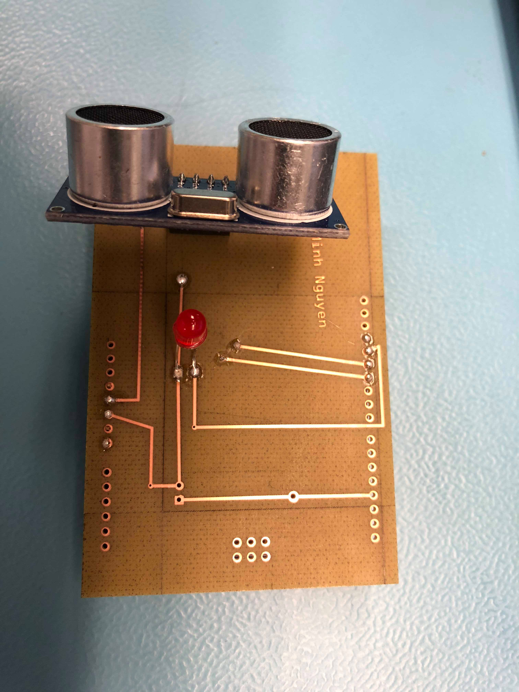
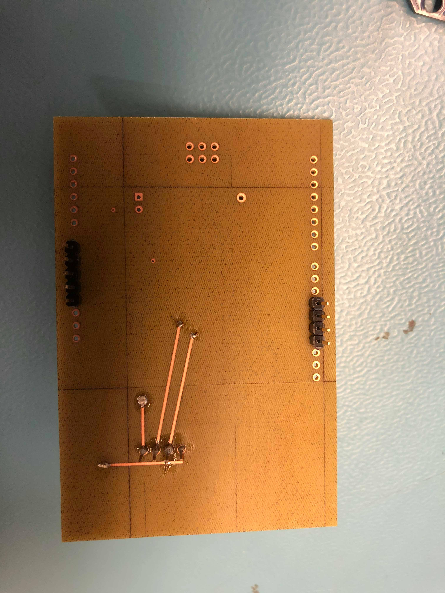
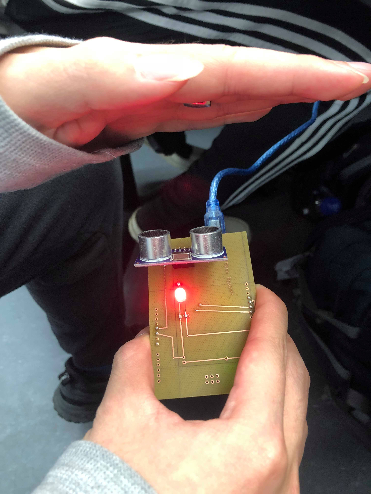
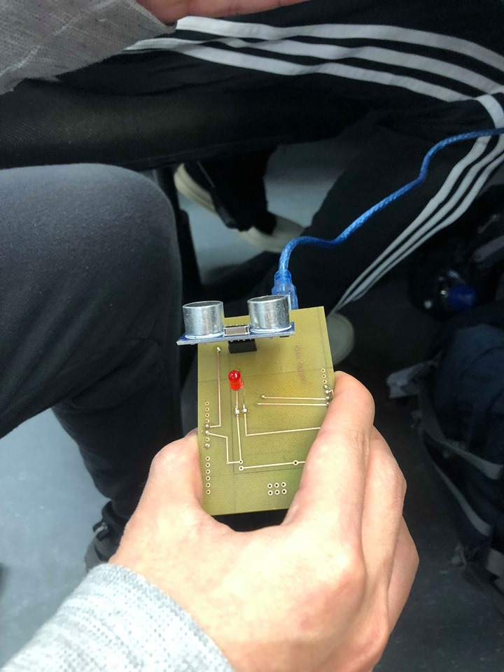
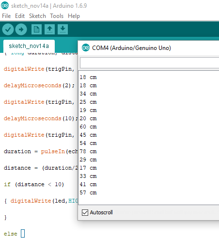

# Smart Mirror - Ultra Sonic Sensor (Light Sensor)
## Table of Contents
* [Introduction](#intro)
# Step to do the project:
* [Step 1 - Prepare Parts](#parts)
* [Step 2 - Timing Plan](#time)
* [Step 3 - Design is Fritzing](#fritz)
* [Step 4 - Breadboard Test](#breadboard)
* [Step 5 - Create PCB and Solder](#pcb)
* [Step 6 - PCB Test](#pcb1)
* [Step 7 - Enclosure](#case)

## <a name="intro">Introduction</a>
* This is the ranging sensor to power up the LED when objects are nearby.

## <a name="parts">Step 1 - Prepare Parts</a>
* [Parts for my project](https://github.com/minhnguyen999/Smart-Mirror/blob/master/documentation/CENG317-PartsForSmartMirror.xlsx) 

# Step 2: design it with Fritzing:
# [Design](https://github.com/minhnguyen999/Smart-Mirror/blob/master/documentation/TuanMinhNguyen2.fzz)
# Breadboard design - [Breadboard](https://github.com/minhnguyen999/Smart-Mirror/blob/master/documentation/breadboard1.png)
# PCB design - [PCB](https://github.com/minhnguyen999/Smart-Mirror/blob/master/documentation/TuanMinhNguyen_pcbNEW.png)
# Schematic design - [Schematic](https://github.com/minhnguyen999/Smart-Mirror/blob/master/documentation/TuanMinhNguyen_schem1.png) 

# Step 3: test the design with breadboard in Ariduino software app with following code:
# Code using in Arduino - [Code](https://github.com/minhnguyen999/Smart-Mirror/blob/master/documentation/arduino%20sensor.docx)
# Breadboard Light Sensor Off - [Light Off](https://github.com/minhnguyen999/Smart-Mirror/blob/master/documentation/IMG_4305.jpg)
 
# Breadboard Light Sensor On - [Light On](https://github.com/minhnguyen999/Smart-Mirror/blob/master/documentation/IMG_4309.jpg) 
 

# Step 4: if step 3 succeeds, laser print the PCB and solder pin header into the PCB 
# [PCB soldered](https://github.com/minhnguyen999/Smart-Mirror/blob/master/documentation/74580334_780354939059517_512763702949183488_n.jpg)
# Top side PCB soldered:
 
# Bottom side PCB soldered:
  

# Step 5: Test code again with the PCB
# [Power Up](https://github.com/minhnguyen999/Smart-Mirror/blob/master/documentation/on.jpg)
# Hand in sensor range:
 
# Hand off sensor range:
 
# Capture:
  

# Step 6: If step 5 succeeeds, make the case for your project to make it protective 
# Go to website Makercase to design then download the .svg file
# Use CorelDraw to open the .svg file then laser print the case
# [Enclosure](https://github.com/minhnguyen999/Smart-Mirror/blob/master/documentation/box.cdr)
 
 

